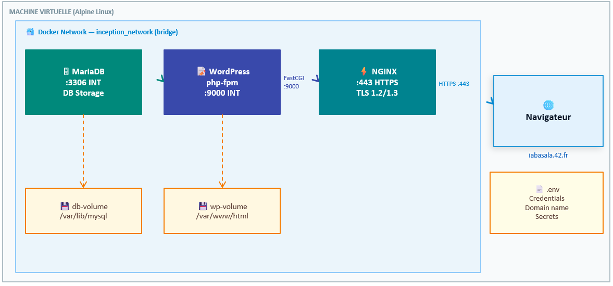
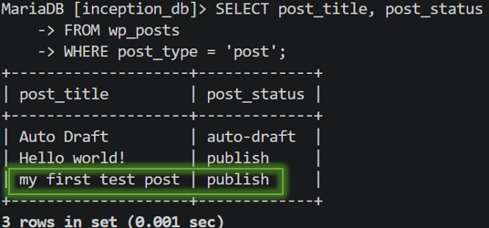
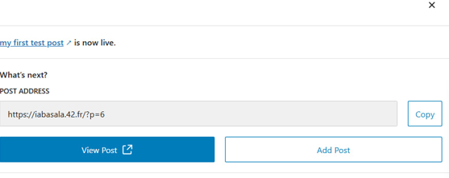
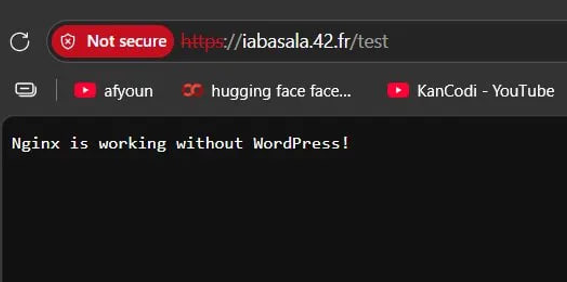
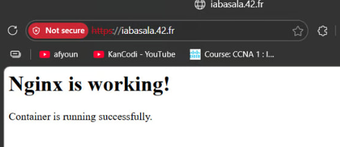
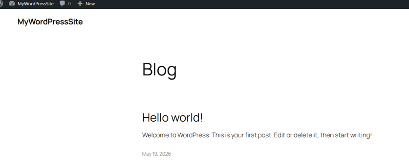
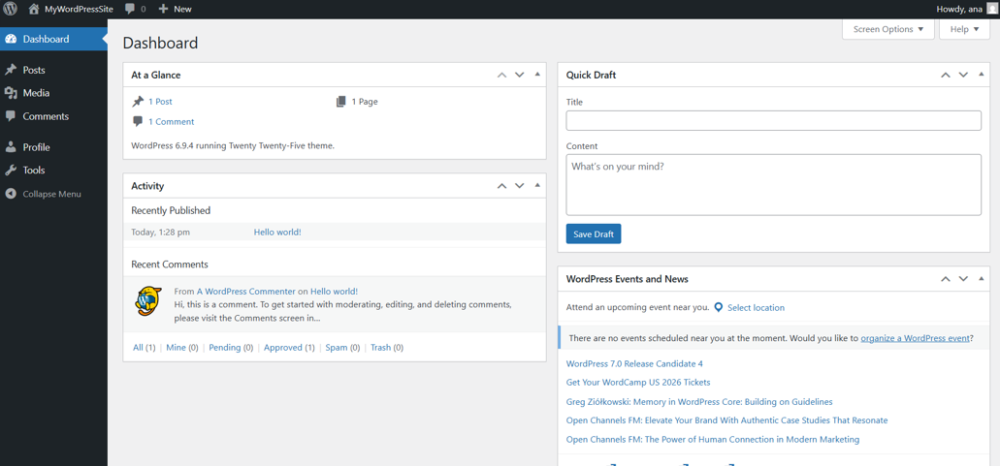

# 🐳 Inception — Full Project Documentation

> **42 School — System Administration Project**
> Build a complete Docker infrastructure from scratch: NGINX + WordPress + MariaDB, secured with TLS, orchestrated with Docker Compose, running on Alpine Linux.

---

## Table of Contents

1. [What is Inception?](#1-what-is-inception)
2. [Project Structure](#2-project-structure)
3. [How Everything is Connected](#3-how-everything-is-connected)
4. [The .env File — Single Source of Truth](#4-the-env-file--single-source-of-truth)
5. [Docker Compose — The Orchestrator](#5-docker-compose--the-orchestrator)
6. [NGINX — The Gatekeeper](#6-nginx--the-gatekeeper)
7. [WordPress + PHP-FPM — The Engine](#7-wordpress--php-fpm--the-engine)
8. [MariaDB — The Memory](#8-mariadb--the-memory)
9. [Volumes — Persistent Storage](#9-volumes--persistent-storage)
10. [Docker Network — Internal Communication](#10-docker-network--internal-communication)
11. [DNS Resolution — How the Domain Works](#11-dns-resolution--how-the-domain-works)
12. [Full Request Flow — URL to Page](#12-full-request-flow--url-to-page)
13. [URL Routing — How Each Path Works](#13-url-routing--how-each-path-works)
14. [TLS/SSL — The Encryption Layer](#14-tlsssl--the-encryption-layer)
15. [How to Run](#15-how-to-run)
16. [Testing Each Service](#16-testing-each-service)
17. [Common Issues & Fixes](#17-common-issues--fixes)
18. [Key Rules from the Subject](#18-key-rules-from-the-subject)

---

## 1. What is Inception?

Inception is a system administration project from 42 School. The goal is to deploy a complete, secure, containerized web infrastructure using Docker — built entirely from scratch, with no pre-built DockerHub images (except Alpine or Debian as base).

### What you build

```
Browser (HTTPS)
      │
      ▼
   NGINX :443          ← only public entry point, handles TLS
      │
      │ FastCGI :9000
      ▼
WordPress + php-fpm    ← executes PHP, builds HTML pages
      │
      │ MySQL :3306
      ▼
   MariaDB              ← stores all website data
      │
      ▼
   db-volume            ← data persisted on disk
```

### Why Docker?

Before Docker, deploying an app meant installing everything directly on the server. It worked on your machine but crashed on the server because of different library versions, different PHP versions, different configurations.

Docker solves this by packaging an application with everything it needs — dependencies, configuration, runtime — into a container. A container runs identically everywhere.

**Container vs Virtual Machine:**

```
Virtual Machine                   Docker Container
┌─────────────────┐               ┌─────────────────┐
│   Application   │               │   Application   │
│   Libs/Deps     │               │   Libs/Deps     │
│   Full OS ~2GB  │               ├─────────────────┤
├─────────────────┤               │  Docker Engine  │
│   Hypervisor    │               │  (shared kernel)│
├─────────────────┤               ├─────────────────┤
│   Host OS       │               │   Host OS       │
└─────────────────┘               └─────────────────┘

→ Heavy, slow to start            → Lightweight ~5MB, instant
```

---

## 2. Project Structure

```
inception/
├── Makefile                          ← shortcuts: make / make clean / make fclean
└── srcs/
    ├── .env                          ← ALL secrets and variables (never commit!)
    ├── docker-compose.yml            ← connects all services together
    └── requirements/
        ├── nginx/
        │   ├── Dockerfile            ← builds NGINX image from Alpine
        │   └── conf/
        │       └── nginx.conf        ← NGINX configuration
        ├── wordpress/
        │   ├── Dockerfile            ← builds WordPress image from Alpine
        │   ├── conf/
        │   │   └── www.conf          ← php-fpm pool configuration
        │   └── tools/
        │       └── setup.sh          ← installs WordPress automatically at startup
        └── mariadb/
            ├── Dockerfile            ← builds MariaDB image from Alpine
            ├── conf/
            │   └── my_config.cnf     ← MariaDB server configuration
            └── tools/
                └── setup.sh          ← initializes database at startup
```

**Why this structure?**

Each service is completely self-contained in its own folder. It has its own Dockerfile (recipe to build the image), its own configuration files, and its own startup script. This separation follows the microservices principle: one container, one responsibility.

---

## 3. How Everything is Connected

```
┌──────────────────────────────────────────────────────────────────┐
│                    VIRTUAL MACHINE (Alpine Linux)                │
│                                                                  │
│  ┌─────────────────────────────────────────────────────────┐    │
│  │           Docker Network: inception_network (bridge)     │    │
│  │                                                          │    │
│  │  ┌───────────────┐    ┌──────────────┐  ┌───────────┐   │    │
│  │  │    NGINX      │───►│  WordPress   │─►│  MariaDB  │   │    │
│  │  │  :443 HTTPS   │    │  php-fpm     │  │  :3306    │   │    │
│  │  │  TLS 1.2/1.3  │    │  :9000 INT  │  │  INT only │   │    │
│  │  └───────────────┘    └──────────────┘  └─────┬─────┘   │    │
│  │          │                   │                │          │    │
│  │          │                wp-volume        db-volume     │    │
│  │          └───────────────────┘                           │    │
│  │                    /var/www/html                         │    │
│  └─────────────────────────────────────────────────────────┘    │
│                                                                  │
│  Port 443:443 → exposed to host                                  │
│  Port 9000, 3306 → internal only                                 │
└──────────────────────────────────────────────────────────────────┘
         ▲
    HTTPS :443
         │
    Browser (Windows)
    iabasala.42.fr → /etc/hosts → 127.0.0.1
```

**The chain in one sentence:**

> Browser → HTTPS → NGINX (TLS termination) → FastCGI → php-fpm (executes WordPress PHP) → MySQL → MariaDB (returns data) → HTML → Browser

---

## 4. The .env File — Single Source of Truth

The `.env` file holds all secrets, credentials, and configuration values. It is the only place where sensitive data lives.

```bash
# srcs/.env

# Domain
DOMAIN_NAME=iabasala.42.fr

# MariaDB credentials
MYSQL_DATABASE=inception_db
MYSQL_USER=username
MYSQL_PASSWORD=yourpassword
MYSQL_ROOT_PASSWORD=rootpassword

# WordPress site
WP_TITLE=Inception
WP_ADMIN=iabasala          # ← must NOT be "admin" or "administrator"
WP_ADMIN_PASSWORD=password
WP_ADMIN_EMAIL=adminemail

# WordPress second user (required by subject)
WP_USER=imane
WP_USER_PASSWORD=Userpass
WP_USER_EMAIL=useremail
```

**Why .env?**

The 42 subject explicitly forbids putting passwords directly in Dockerfiles or docker-compose.yml. Reasons:

1. If the code is on GitHub, credentials would be exposed
2. Changing a password means editing one file, not hunting through code
3. Docker Compose automatically reads `.env` and injects variables into containers

**Never commit `.env` to git.** Add it to `.gitignore`:

```
srcs/.env
*.phar
```

**How variables flow:**

```
.env file
  │
  │ docker-compose reads → env_file: .env
  ▼
Container environment variables
  │
  │ setup.sh reads → ${MYSQL_DATABASE}, ${WP_ADMIN}, etc.
  ▼
Service is configured with correct values
```

---

## 5. Docker Compose — The Orchestrator

`docker-compose.yml` is the file that connects everything. Without it, you'd have to start each container manually with 10 different `docker run` commands.

```yaml
# srcs/docker-compose.yml

version: '3.8'

services:

  # ── MariaDB ─────────────────────────────────────────────
  mariadb:
    build: ./requirements/mariadb   # build image from this Dockerfile
    container_name: mariadb          # also used as DNS name in Docker network
    restart: unless-stopped          # auto-restart if it crashes
    env_file: .env                   # inject all .env variables
    volumes:
      - db-volume:/var/lib/mysql     # persist database files on host
    networks:
      - inception_network

  # ── WordPress ────────────────────────────────────────────
  wordpress:
    build: ./requirements/wordpress
    container_name: wordpress
    restart: unless-stopped
    depends_on:
      - mariadb                      # start mariadb first
    env_file: .env
    volumes:
      - wp-volume:/var/www/html      # persist WordPress files
    expose:
      - "9000"                       # visible inside Docker network only
    networks:
      - inception_network

  # ── NGINX ────────────────────────────────────────────────
  nginx:
    build: ./requirements/nginx
    container_name: nginx
    restart: unless-stopped
    depends_on:
      - wordpress                    # start wordpress first
    ports:
      - "443:443"                    # only exposed port to the outside world
    volumes:
      - wp-volume:/var/www/html      # needs WP files to serve static assets
    networks:
      - inception_network

# ── Volumes ──────────────────────────────────────────────
volumes:
  wp-volume:    # Docker manages location automatically
  db-volume:

# ── Network ──────────────────────────────────────────────
networks:
  inception_network:
    driver: bridge
```

### Key concepts in docker-compose.yml

| Directive | What it does |
|-----------|-------------|
| `build:` | Points to Dockerfile folder — Docker builds image from scratch |
| `container_name:` | Sets name used for Docker DNS resolution |
| `restart: unless-stopped` | Auto-restart on crash, except when manually stopped |
| `env_file: .env` | Injects all variables from .env into container |
| `depends_on:` | Startup order — mariadb before wordpress before nginx |
| `expose:` | Port visible only inside Docker network (not from host) |
| `ports:` | Maps host port to container port — accessible from outside |
| `volumes:` | Mounts persistent storage into container |
| `networks:` | Connects container to Docker bridge network |

### Startup order

```
docker compose up

  Step 1: MariaDB starts
          └── setup.sh runs → creates DB, user, permissions
          └── mysqld listening on :3306

  Step 2: WordPress starts (depends_on: mariadb)
          └── setup.sh waits for MariaDB to be ready
          └── wp-cli downloads and installs WordPress
          └── php-fpm listening on :9000

  Step 3: NGINX starts (depends_on: wordpress)
          └── nginx.conf loaded
          └── SSL certificate loaded
          └── Listening on :443
```

> **Note:** `depends_on` only guarantees startup order, not that a service is fully ready. That's why `setup.sh` for WordPress has a loop that waits for MariaDB to actually respond.

---

## 6. NGINX — The Gatekeeper

### What NGINX does

NGINX is the only container exposed to the outside world. It:
- Listens on port 443 (HTTPS)
- Handles TLS encryption/decryption
- Serves static files directly (images, CSS, JS)
- Forwards PHP requests to WordPress via FastCGI

### Dockerfile

```dockerfile
FROM alpine:3.18

# Install NGINX and OpenSSL
RUN apk update && apk upgrade && apk add --no-cache \
    nginx \
    openssl

# Generate self-signed SSL certificate during image build
RUN mkdir -p /etc/nginx/ssl && \
    openssl req -x509 \
        -nodes \
        -days 365 \
        -newkey rsa:2048 \
        -keyout /etc/nginx/ssl/inception.key \
        -out    /etc/nginx/ssl/inception.crt \
        -subj   "/C=MA/ST=Casablanca/O=42/CN=iabasala.42.fr"

# Copy our custom NGINX configuration
COPY conf/nginx.conf /etc/nginx/nginx.conf

# Document that this container uses port 443
EXPOSE 443

# Start NGINX in foreground (daemon off = stays as PID 1)
CMD ["nginx", "-g", "daemon off;"]
```

**Why `daemon off;`?**

By default, NGINX starts as a background process (daemon). Docker needs the main process to stay in the foreground — if the foreground process exits, the container stops. `daemon off;` keeps NGINX as PID 1, the main process.

**Why exec form `CMD ["nginx", ...]` instead of shell form `CMD nginx ...`?**

```
Shell form:  CMD nginx -g 'daemon off;'
→ Docker runs: /bin/sh -c "nginx -g 'daemon off;'"
→ PID 1 = /bin/sh (the shell)
→ NGINX is a child process of the shell
→ When Docker sends SIGTERM to stop, /bin/sh receives it
→ NGINX may not receive the signal → container hangs

Exec form:  CMD ["nginx", "-g", "daemon off;"]
→ Docker runs: nginx -g "daemon off;" directly
→ PID 1 = nginx
→ SIGTERM goes directly to NGINX → clean shutdown ✓
```

### nginx.conf explained line by line

```nginx
events {
    worker_connections 1024;
    # Maximum simultaneous connections per worker process
}

http {
    include       /etc/nginx/mime.types;
    # Tell NGINX what Content-Type to send for each file extension
    # .css → text/css, .js → application/javascript, .jpg → image/jpeg

    default_type  application/octet-stream;
    # Unknown file types are sent as binary download

    server {

        # ── Ports and Protocol ─────────────────────────────────

        listen 443 ssl;
        # Listen for HTTPS traffic on port 443 (IPv4)

        listen [::]:443 ssl;
        # Listen on port 443 for IPv6 too ([::] = all IPv6 interfaces)

        # ── Domain ─────────────────────────────────────────────

        server_name iabasala.42.fr;
        # Only respond to requests for this domain
        # If a request comes in for a different domain, reject it

        # ── TLS/SSL Certificates ────────────────────────────────

        ssl_certificate     /etc/nginx/ssl/inception.crt;
        # The public certificate shown to browsers
        # Generated during docker build with openssl

        ssl_certificate_key /etc/nginx/ssl/inception.key;
        # The private key - NEVER share this
        # Used to decrypt incoming requests

        ssl_protocols       TLSv1.2 TLSv1.3;
        # Only allow modern TLS versions
        # TLSv1.0 and TLSv1.1 are deprecated (insecure since 2020)
        # Subject requires this exact restriction

        # ── File Serving ────────────────────────────────────────

        root  /var/www/html;
        # All files are served from this directory
        # Mounted via wp-volume → same files WordPress writes

        index index.php index.html;
        # When a directory is requested (/), try index.php first
        # then index.html as fallback

        # ── Request Routing ─────────────────────────────────────

        location / {
            try_files $uri $uri/ /index.php?$args;
            # For every request:
            # 1. Check if $uri is a real FILE on disk → serve it directly
            # 2. Check if $uri is a real FOLDER on disk → serve its index
            # 3. Neither found → send to /index.php (WordPress handles it)
            #
            # This is what makes WordPress pretty URLs work:
            # /about, /shop, /blog/post-1 don't exist as files
            # They're generated dynamically by WordPress via index.php
        }

        # ── PHP Execution ───────────────────────────────────────

        location ~ \.php$ {
            # Match any URL ending with .php
            # ~ means regex matching, \.php$ means "ends with .php"

            include        fastcgi_params;
            # Include standard FastCGI parameters from /etc/nginx/fastcgi_params
            # These tell php-fpm: REQUEST_METHOD, SERVER_NAME, QUERY_STRING, etc.

            fastcgi_pass   wordpress:9000;
            # Send PHP request to the WordPress container on port 9000
            # "wordpress" is resolved by Docker's internal DNS
            # Do NOT use 127.0.0.1 - that's localhost inside NGINX container
            # Docker DNS translates "wordpress" to its container IP automatically

            fastcgi_index  index.php;
            # If request is a directory, default to index.php

            fastcgi_split_path_info ^(.+\.php)(/.+)$;
            # Split URL: /index.php/extra/path
            #   Part 1 (script): /index.php
            #   Part 2 (path info): /extra/path
            # Needed for WordPress REST API and some plugins

            fastcgi_param  SCRIPT_FILENAME
                           $document_root$fastcgi_script_name;
            # THE MOST CRITICAL LINE
            # Tells php-fpm EXACTLY which file to execute
            # $document_root = /var/www/html
            # $fastcgi_script_name = /index.php
            # Result: /var/www/html/index.php
            # Without this line → php-fpm doesn't know what to run → blank page

            fastcgi_param  PATH_INFO $fastcgi_path_info;
            # Sends the extra path info to PHP
            # Available as $_SERVER['PATH_INFO'] in PHP code
        }
    }
}
```

---

## 7. WordPress + PHP-FPM — The Engine

### What WordPress + php-fpm does

- php-fpm listens on port 9000 for FastCGI requests from NGINX
- When NGINX forwards a PHP request, php-fpm executes the PHP code
- WordPress PHP code queries MariaDB and generates HTML
- HTML is returned to NGINX, which sends it to the browser

### Dockerfile

```dockerfile
FROM alpine:3.18

# Install PHP 8.2 and all extensions WordPress needs
RUN apk update && apk upgrade && apk add --no-cache \
    php82            \   # PHP interpreter
    php82-fpm        \   # FastCGI Process Manager
    php82-mysqli     \   # MySQL/MariaDB connection
    php82-json       \   # JSON encoding/decoding
    php82-curl       \   # HTTP requests
    php82-dom        \   # HTML/XML parsing
    php82-mbstring   \   # Multi-byte string handling (Arabic, French chars)
    php82-openssl    \   # Encryption
    php82-xml        \   # XML processing
    php82-phar       \   # PHP archives (needed for wp-cli)
    php82-session    \   # User sessions (login)
    php82-tokenizer  \   # PHP tokenizer
    php82-fileinfo   \   # File type detection
    php82-iconv      \   # Character encoding
    php82-zip        \   # ZIP extraction (plugins/themes)
    wget             \   # Download files
    curl             \   # HTTP client
    bash             \   # Bash scripting
    mysql-client     \   # MySQL CLI (to test MariaDB connection)
    ca-certificates      # SSL certificate verification

# Create symlink so "php" command works (Alpine names it "php82")
RUN ln -s /usr/bin/php82 /usr/bin/php

# Increase PHP memory limit for wp-cli (needs 256MB to extract WordPress)
RUN echo "memory_limit=256M" > /etc/php82/conf.d/memory.ini

# Copy wp-cli (WordPress command line tool)
# Downloaded separately because network may block GitHub during build
COPY wp-cli.phar /usr/local/bin/wp
RUN chmod +x /usr/local/bin/wp

# Create web root directory
RUN mkdir -p /var/www/html \
    && chown -R nobody:nobody /var/www/html

# Copy php-fpm pool configuration
COPY conf/www.conf /etc/php82/php-fpm.d/www.conf

# Copy startup script
COPY tools/setup.sh /setup.sh
RUN chmod +x /setup.sh

EXPOSE 9000

CMD ["/setup.sh"]
```

### www.conf — PHP-FPM Pool Configuration

```ini
[www]

; Run php-fpm as nobody (not root — security)
user  = nobody
group = nobody

; Listen on ALL interfaces, port 9000
; 0.0.0.0 = accept from any IP
; If you write 127.0.0.1, only localhost can connect
; NGINX is in a different container → needs 0.0.0.0
listen = 0.0.0.0:9000

; Allow any IP to connect (NGINX container IP varies)
listen.allowed_clients = any

; Worker process management
pm                   = dynamic   ; create workers as needed
pm.max_children      = 5         ; never more than 5 PHP workers at once
pm.start_servers     = 2         ; start with 2 workers
pm.min_spare_servers = 1         ; keep at least 1 idle worker
pm.max_spare_servers = 3         ; never more than 3 idle workers

; Log errors to stderr so docker logs can show them
php_admin_value[error_log] = /dev/stderr
php_admin_flag[log_errors]  = on
```

### setup.sh — WordPress Auto-Installation

```bash
#!/bin/bash

# Increase memory for wp-cli operations
export WP_CLI_PHP_ARGS="-d memory_limit=256M"

# ────────────────────────────────────────────────────────
# STEP 1: Wait for MariaDB to be ready
# ────────────────────────────────────────────────────────
# depends_on only guarantees MariaDB container started,
# not that mysqld is actually accepting connections yet.
# This loop retries every 2 seconds until MariaDB responds.

echo "Waiting for MariaDB..."
while ! mysql -h mariadb \
              -u "${MYSQL_USER}" \
              -p"${MYSQL_PASSWORD}" \
              -e "SELECT 1;" > /dev/null 2>&1; do
    echo "MariaDB not ready yet, waiting..."
    sleep 2
done
echo "MariaDB is ready ✓"

# ────────────────────────────────────────────────────────
# STEP 2-6: Install WordPress (only if not already done)
# ────────────────────────────────────────────────────────
# We check for wp-config.php — if it exists, WP was already
# installed (previous run). Skip installation, go straight
# to starting php-fpm.

cd /var/www/html

if [ ! -f wp-config.php ]; then

    # STEP 2: Download WordPress core files
    echo "Downloading WordPress..."
    wp core download \
        --allow-root \
        --locale=en_US
    # Downloads ~25MB of PHP files into /var/www/html
    # --allow-root: wp-cli warns about running as root, this silences it

    # STEP 3: Generate wp-config.php
    echo "Creating wp-config.php..."
    wp config create \
        --allow-root \
        --dbname="${MYSQL_DATABASE}" \
        --dbuser="${MYSQL_USER}" \
        --dbpass="${MYSQL_PASSWORD}" \
        --dbhost="mariadb" \
        # "mariadb" = Docker container name, resolved by Docker DNS
        --url="https://${DOMAIN_NAME}"
    # Creates /var/www/html/wp-config.php
    # This file connects WordPress to MariaDB

    # STEP 4: Install WordPress (creates all database tables)
    echo "Installing WordPress..."
    wp core install \
        --allow-root \
        --url="https://${DOMAIN_NAME}" \
        --title="${WP_TITLE}" \
        --admin_user="${WP_ADMIN}" \
        --admin_password="${WP_ADMIN_PASSWORD}" \
        --admin_email="${WP_ADMIN_EMAIL}" \
        --skip-email
    # Creates tables: wp_posts, wp_users, wp_options, wp_comments, etc.
    # Creates the admin user account
    # Configures site URL and title in wp_options table

    # STEP 5: Create second user (required by 42 subject)
    echo "Creating second user..."
    wp user create \
        --allow-root \
        "${WP_USER}" \
        "${WP_USER_EMAIL}" \
        --role=author \
        --user_pass="${WP_USER_PASSWORD}"
    # Role "author" = can write posts but not change site settings
    # Subject requires admin username ≠ "admin" or "administrator"

    echo "WordPress installed ✓"
fi

# ────────────────────────────────────────────────────────
# STEP 6: Start php-fpm permanently
# ────────────────────────────────────────────────────────
echo "Starting php-fpm..."
exec php-fpm82 -F
# exec = replace this shell process with php-fpm
#        shell was PID 1 → now php-fpm IS PID 1
# -F = foreground mode, don't daemonize
#      Docker needs the main process in foreground
```

---

## 8. MariaDB — The Memory

### What MariaDB does

MariaDB stores everything WordPress needs to function:

| Table | Content |
|-------|---------|
| `wp_posts` | All articles, pages, media |
| `wp_users` | User accounts and passwords |
| `wp_options` | Site settings (title, URL, theme) |
| `wp_comments` | Comments on posts |
| `wp_terms` | Categories and tags |

Every time you visit a WordPress page, PHP executes SQL queries against MariaDB to fetch the content for that page.

### Dockerfile

```dockerfile
FROM alpine:3.18

# Install MariaDB server and client tools
RUN apk update && apk upgrade && apk add --no-cache \
    mariadb        \   # the database server (mysqld process)
    mariadb-client \   # command line tools: mysql, mysqladmin, mysqldump
    openssl            # for secure connections

# Create data directory and socket directory
# chown -R mysql:mysql = MariaDB must run as mysql user, not root
RUN mkdir -p /var/lib/mysql \
    && mkdir -p /run/mysqld \
    && chown -R mysql:mysql /var/lib/mysql \
    && chown -R mysql:mysql /run/mysqld

# Copy server configuration
COPY conf/my_config.cnf /etc/my.cnf.d/my_config.cnf

# Copy initialization script
COPY tools/setup.sh /setup.sh
RUN chmod +x /setup.sh

EXPOSE 3306

CMD ["/setup.sh"]
```

### my_config.cnf — MariaDB Server Configuration

```ini
[mysqld]

# ── Networking ──────────────────────────────────────────────────

bind-address = 0.0.0.0
# Accept connections from ANY IP address
# 0.0.0.0 = all network interfaces
# If set to 127.0.0.1, only localhost can connect
# WordPress container has a different IP → MUST be 0.0.0.0

port = 3306
# Standard MySQL/MariaDB port
# WordPress knows to use 3306 by default

skip-networking = 0
# 0 = TCP networking ENABLED
# 1 = only unix sockets (WordPress container can't connect via socket)
# Must be 0 for Docker container-to-container communication

# ── Performance / DNS ───────────────────────────────────────────

skip-name-resolve
# Do NOT try to resolve client IP addresses to hostnames via DNS
# In Docker, container IPs change every restart
# DNS resolution would be slow and unreliable
# Use IP addresses directly

skip-host-cache
# Do not cache hostname lookups
# Same reason: Docker IPs are dynamic

# ── Data ────────────────────────────────────────────────────────

datadir = /var/lib/mysql
# Where MariaDB stores all database files
# This directory is mounted as db-volume
# Data survives container restarts because it's on the host filesystem

socket = /run/mysqld/mysqld.sock
# Unix socket file for local connections
# Faster than TCP for same-machine connections
# Used by mysqladmin ping to check server status

# ── Security ────────────────────────────────────────────────────

symbolic-links = 0
# Disable symbolic links for database files
# Prevents attackers from using symlinks to access files outside datadir
```

### setup.sh — MariaDB Initialization

```bash
#!/bin/sh

# ────────────────────────────────────────────────────────
# STEP 1: Create socket directory (survives volume mounts)
# ────────────────────────────────────────────────────────
mkdir -p /run/mysqld
chown -R mysql:mysql /run/mysqld
# /run/mysqld is needed for the unix socket file
# Must be created before mysqld starts

# ────────────────────────────────────────────────────────
# STEP 2: Initialize data directory (first run only)
# ────────────────────────────────────────────────────────
if [ ! -d "/var/lib/mysql/mysql" ]; then
# /var/lib/mysql/mysql is the system database folder
# If it exists → MariaDB already initialized → skip setup
# If it doesn't → first run → initialize everything

    echo "Initializing MariaDB..."

    # Create system tables in /var/lib/mysql
    mysql_install_db \
        --user=mysql \
        --basedir=/usr \
        --datadir=/var/lib/mysql \
        > /dev/null
    # This creates the mysql, information_schema, performance_schema databases
    # Required before MariaDB can start for the first time

    # ────────────────────────────────────────────────────
    # STEP 3: Start MariaDB temporarily (no network)
    # ────────────────────────────────────────────────────
    mysqld --user=mysql --skip-networking &
    MYSQL_PID=$!
    # --skip-networking: no TCP connections during initialization
    # Only accessible via unix socket locally
    # & = run in background, save process ID

    # Wait until MariaDB is actually accepting connections
    echo "Waiting for MariaDB to start..."
    while ! mysqladmin ping --silent 2>/dev/null; do
        sleep 1
    done
    echo "MariaDB started temporarily ✓"

    # ────────────────────────────────────────────────────
    # STEP 4: Run setup SQL
    # ────────────────────────────────────────────────────
    mysql -u root << EOF

-- Create WordPress database
CREATE DATABASE IF NOT EXISTS ${MYSQL_DATABASE};

-- Create WordPress user accessible from any host
-- % = wildcard, means "from any IP address"
-- This is required because WordPress is in a different container
CREATE USER IF NOT EXISTS '${MYSQL_USER}'@'%'
    IDENTIFIED BY '${MYSQL_PASSWORD}';

-- Give WordPress user full access to its database only
GRANT ALL PRIVILEGES ON ${MYSQL_DATABASE}.*
    TO '${MYSQL_USER}'@'%';

-- Set root password (default = no password = insecure)
SET PASSWORD FOR 'root'@'localhost' =
    PASSWORD('${MYSQL_ROOT_PASSWORD}');

-- Apply permission changes immediately
FLUSH PRIVILEGES;
EOF

    # ────────────────────────────────────────────────────
    # STEP 5: Stop the temporary MariaDB
    # ────────────────────────────────────────────────────
    kill $MYSQL_PID
    wait $MYSQL_PID
    echo "MariaDB setup complete ✓"

fi

# ────────────────────────────────────────────────────────
# STEP 6: Start MariaDB permanently in foreground
# ────────────────────────────────────────────────────────
echo "Starting MariaDB..."
exec mysqld \
    --user=mysql \
    --console \
    --port=3306 \
    --bind-address=0.0.0.0
# exec = replace this shell with mysqld → mysqld becomes PID 1
# --console = log to stdout (visible in docker logs)
# --port=3306 = explicitly listen on correct port
# --bind-address=0.0.0.0 = accept connections from Docker network
```

---

## 9. Volumes — Persistent Storage

### The problem without volumes

A Docker container is ephemeral. When it stops, everything written to its filesystem disappears.

```
Without volumes:
  Container starts → MariaDB creates 50 WordPress posts
  Container stops  → /var/lib/mysql is wiped
  Container starts → Empty database, 50 posts gone ✗

With volumes:
  Container starts → MariaDB writes to /var/lib/mysql
                     which is mounted from host at db-volume
  Container stops  → /var/lib/mysql on HOST is preserved
  Container starts → Mounts the same data → 50 posts still there ✓
```

### How volumes work

```
Host machine (WSL)                    Container
───────────────────────               ─────────────────────────────
Docker managed storage
  └─ srcs_db-volume/       ═══════► /var/lib/mysql  (MariaDB data)
       _data/
         ibdata1
         inception_db/
           wp_posts.ibd
           wp_users.ibd

  └─ srcs_wp-volume/       ═══════► /var/www/html   (WordPress files)
       _data/                        AND
         index.php                   /var/www/html   (NGINX reads too)
         wp-config.php
         wp-content/
```

### Two volumes in this project

**`wp-volume`** — WordPress files
- Mounted at `/var/www/html` in both WordPress and NGINX containers
- WordPress writes its files here (install, uploads, themes)
- NGINX reads from here to serve static files directly
- Shared between two containers — they see the exact same files

**`db-volume`** — MariaDB data
- Mounted at `/var/lib/mysql` in MariaDB container only
- MariaDB writes all database tables here
- Nobody else should access raw database files directly

### Volume in docker-compose.yml

```yaml
# Simple named volume (Docker manages location)
volumes:
  wp-volume:
  db-volume:

# OR explicit bind mount (you control the path)
volumes:
  db-volume:
    driver: local
    driver_opts:
      type: none
      o: bind
      device: /home/im_ane/data/db
```

> **Note on WSL2:** Bind mounts with explicit paths can fail on WSL2 due to Docker Desktop's internal network. Named volumes (without driver_opts) work reliably on WSL2.

---

## 10. Docker Network — Internal Communication

### How containers find each other

Docker Compose creates a private bridge network for all services defined in `docker-compose.yml`. Every container gets:
- A private IP address (e.g., 172.18.0.2, 172.18.0.3, 172.18.0.4)
- A DNS entry using its `container_name`

```
inception_network (bridge 172.18.0.0/16)
├── nginx      → 172.18.0.2  ← DNS: "nginx"
├── wordpress  → 172.18.0.3  ← DNS: "wordpress"
└── mariadb    → 172.18.0.4  ← DNS: "mariadb"
```

### Why names instead of IPs

Container IPs change every time you restart. Names never change.

```nginx
# WRONG: hardcoded IP (changes on restart)
fastcgi_pass 172.18.0.3:9000;

# CORRECT: Docker DNS resolves the name
fastcgi_pass wordpress:9000;
```

### expose vs ports — Critical security difference

```yaml
# expose: 9000
# → Port is visible ONLY to other containers in the same Docker network
# → Host machine CANNOT reach this port
# → Internet CANNOT reach this port
# → Only WordPress needs to expose 9000 because only NGINX connects to it

wordpress:
  expose:
    - "9000"

# ports: "443:443"
# → HOST_PORT:CONTAINER_PORT
# → Port 443 on the HOST machine maps to port 443 in the container
# → Browser on Windows connects to 127.0.0.1:443
# → Docker forwards to nginx container port 443
# → ONLY NGINX should have ports: mapping

nginx:
  ports:
    - "443:443"
```

**Security principle:** Only NGINX faces the internet. WordPress and MariaDB are completely hidden.

```
Internet / Browser
       │
   Port 443 ←── only this port exists on the host
       │
     NGINX
       │
   Port 9000 ←── internal Docker only, not reachable from outside
       │
  WordPress
       │
   Port 3306 ←── internal Docker only, not even "exposed"
       │
   MariaDB
```

---

## 11. DNS Resolution — How the Domain Works

### The problem

`iabasala.42.fr` is not a real internet domain. No DNS server in the world knows it. If you type it in a browser, you get `DNS_PROBE_FINISHED_NXDOMAIN`.

### The solution — /etc/hosts

Every OS checks a local file before asking a DNS server:
- Linux/Mac: `/etc/hosts`
- Windows: `C:\Windows\System32\drivers\etc\hosts`

This file maps domain names to IP addresses locally, bypassing DNS entirely.

Add this line:
```
127.0.0.1   iabasala.42.fr
```

Now when the browser looks up `iabasala.42.fr`, it finds `127.0.0.1` in the local file and connects to localhost — our own machine — where NGINX is listening on port 443.

### WSL2 complication

WSL2 (Windows Subsystem for Linux 2) has its own separate network stack. The browser runs on Windows, so:

1. **Linux WSL `/etc/hosts`** — needed for `curl` and command-line tools
2. **Windows `C:\Windows\System32\drivers\etc\hosts`** — needed for the browser

Both must have the entry `127.0.0.1 iabasala.42.fr`.

### WSL2 regenerates /etc/hosts on restart

Fix this by telling WSL not to auto-generate:

```ini
# /etc/wsl.conf
[network]
generateHosts = false
```

Then restart WSL from PowerShell:
```powershell
wsl --shutdown
```

### DNS resolution flow

```
Browser types: https://iabasala.42.fr
       │
       │ 1. Check Windows hosts file
       │    127.0.0.1  iabasala.42.fr ← found!
       │
       │ 2. Do NOT ask DNS servers (found locally)
       │
       ▼
127.0.0.1:443 (localhost)
       │
       ▼
NGINX container (listening on :443) ✓
```

---

## 12. Full Request Flow — URL to Page

This is what happens, step by step, every time you visit `https://iabasala.42.fr/`:

```
Step 1 — DNS Resolution
───────────────────────
Browser: "Who is iabasala.42.fr?"
Windows hosts file: "127.0.0.1"
Browser connects to 127.0.0.1:443

Step 2 — TCP Connection + TLS Handshake
────────────────────────────────────────
Browser → TCP SYN → 127.0.0.1:443
NGINX accepts connection
NGINX presents inception.crt (SSL certificate)
Browser: "This cert is self-signed → show warning"
User clicks "Advanced" → "Proceed"
TLS 1.3 tunnel established
All traffic from here is encrypted ✓

Step 3 — HTTP Request inside TLS tunnel
────────────────────────────────────────
Browser sends (encrypted):
  GET / HTTP/1.1
  Host: iabasala.42.fr

NGINX decrypts and reads the request

Step 4 — NGINX Routing Decision
────────────────────────────────
NGINX reads URL: /

location / { try_files $uri $uri/ /index.php?$args; }

try_files checks:
  1. Does /var/www/html/ (directory) exist? YES
     Does it contain index.php? YES
  → URL becomes /index.php

Now matches: location ~ \.php$
→ Forward to php-fpm via FastCGI

Step 5 — Docker DNS Resolution
────────────────────────────────
NGINX: "send to wordpress:9000"
Docker DNS: "wordpress" → 172.18.0.3
NGINX connects to 172.18.0.3:9000

Step 6 — php-fpm Receives FastCGI Request
──────────────────────────────────────────
php-fpm receives:
  SCRIPT_FILENAME = /var/www/html/index.php
  REQUEST_URI     = /
  SERVER_NAME     = iabasala.42.fr
  REQUEST_METHOD  = GET

php-fpm picks an available worker from the pool
Worker executes /var/www/html/index.php

Step 7 — WordPress Executes
─────────────────────────────
index.php bootstraps WordPress:
  - Reads wp-config.php (DB credentials)
  - Connects to MariaDB at "mariadb:3306"
  - Reads REQUEST_URI = /
  - "User wants the homepage"

Step 8 — SQL Queries to MariaDB
─────────────────────────────────
WordPress sends SQL (via "mariadb" Docker DNS):
  SELECT * FROM wp_posts
  WHERE post_status = 'publish'
  ORDER BY post_date DESC
  LIMIT 10;

  SELECT option_value FROM wp_options
  WHERE option_name IN ('blogname', 'siteurl', 'template');

MariaDB returns the data

Step 9 — WordPress Builds HTML
─────────────────────────────────
WordPress takes the DB data
Applies the active theme template
Generates complete HTML page

Step 10 — Response travels back
─────────────────────────────────
HTML string → php-fpm → FastCGI → NGINX
NGINX encrypts the HTML with TLS
NGINX sends encrypted response to browser

Step 11 — Browser renders
──────────────────────────
Browser decrypts the response
Parses HTML → requests CSS/JS/images
For static files (CSS/images): NGINX serves them directly
Browser renders the WordPress homepage ✓

Total time: < 100ms
```

---

## 13. URL Routing — How Each Path Works

### `/` — Homepage

```
Browser: https://iabasala.42.fr/
                                │
                          NGINX receives
                                │
location / {                    │
  try_files                     │
    $uri     → /var/www/html/   ← it's a directory
    $uri/    → index.php found inside!
    → serve /index.php
}                               │
                                │
location ~ \.php$ matches       │
fastcgi_pass wordpress:9000     │
                                │
WordPress: REQUEST_URI = /      │
→ show latest posts (homepage)  ✓
```

### `/wp-admin` — Admin Panel

```
Browser: https://iabasala.42.fr/wp-admin
                                    │
                              NGINX receives
                                    │
try_files:
  $uri  → /var/www/html/wp-admin    ← it's a REAL FOLDER on disk!
  $uri/ → /var/www/html/wp-admin/   ← index.php exists inside!
  → /wp-admin/index.php
                                    │
location ~ \.php$ matches           │
fastcgi_pass wordpress:9000         │
                                    │
WordPress executes wp-admin/index.php
→ checks if user is logged in
→ if yes: show dashboard
→ if no: redirect to /wp-login.php  ✓
```

### `/about` — A WordPress Page

```
Browser: https://iabasala.42.fr/about
                                    │
                              NGINX receives
                                    │
try_files:
  $uri  → /var/www/html/about       ← no file called "about"
  $uri/ → /var/www/html/about/      ← no folder called "about"
  → fallback: /index.php?           ← WordPress routing!
                                    │
WordPress: REQUEST_URI = /about
→ SELECT * FROM wp_posts
  WHERE post_name = 'about'         ← looks up slug in DB
→ generates "About" page HTML       ✓
```

### `/wp-content/uploads/image.jpg` — Static File

```
Browser: GET /wp-content/uploads/image.jpg
                                    │
                              NGINX receives
                                    │
try_files:
  $uri → /var/www/html/wp-content/uploads/image.jpg
       → FILE EXISTS ON DISK ✓
       → NGINX serves it DIRECTLY
       → php-fpm is NOT involved at all
       → faster, no PHP execution needed  ✓
```

### Static vs Dynamic content

| Content Type | Handled By | Path |
|-------------|-----------|------|
| Images, CSS, JS, fonts | NGINX directly | Files exist on disk in wp-volume |
| PHP pages (homepage, posts) | NGINX → php-fpm → WordPress | /index.php handles all |
| Admin panel | NGINX → php-fpm → WordPress | /wp-admin/index.php |
| WordPress API | NGINX → php-fpm → WordPress | /index.php/wp-json/... |

---

## 14. TLS/SSL — The Encryption Layer

### HTTP vs HTTPS

```
HTTP (unencrypted):
  Browser → "GET /wp-login.php + password=secret"
  Anyone on the network can read this: "password=secret" ✗

HTTPS (TLS encrypted):
  Browser → [encrypted garbage] → NGINX
  Intercepted: "aK3#9xPQ2@..." → unreadable ✓
```

### How TLS works (simplified)

```
1. Browser connects to NGINX
2. NGINX shows its certificate (inception.crt)
   Certificate contains:
     - Domain: iabasala.42.fr
     - Public key (used to encrypt)
     - Signature (who signed it)

3. Browser checks certificate:
   - Is the domain correct? YES
   - Is it signed by a trusted authority? NO (self-signed)
   - → Warning "Not secure" shown ← normal for local dev

4. Browser generates a random session key
   Encrypts it with NGINX's public key
   Sends to NGINX

5. NGINX decrypts session key with its private key (inception.key)
   Now BOTH sides have the session key
   All further communication encrypted with this key

6. Encrypted tunnel established ✓
   Nobody in between can read the traffic
```

### Generating the certificate

```bash
openssl req -x509 \
    -nodes \           # no passphrase on the key
    -days 365 \        # valid for 1 year
    -newkey rsa:2048 \ # generate new 2048-bit RSA key pair
    -keyout inception.key \  # private key
    -out inception.crt \     # public certificate
    -subj "/C=MA/ST=Casablanca/O=42/CN=iabasala.42.fr"
#           country  state      org    Common Name (domain)
```

This runs during the NGINX image build. The certificate and key are baked into the image.

### Why TLS 1.2 and 1.3 only?

| Version | Status | Reason |
|---------|--------|--------|
| TLS 1.0 | ❌ Deprecated 2020 | Vulnerable to POODLE, BEAST attacks |
| TLS 1.1 | ❌ Deprecated 2020 | Similar vulnerabilities |
| TLS 1.2 | ✅ Current | Secure, widely supported |
| TLS 1.3 | ✅ Latest | Fastest, most secure, fewer round trips |

---

## 15. How to Run

### Prerequisites

- Docker Desktop running on Windows
- WSL2 installed
- Domain in hosts file

### Add domain to hosts (do this once)

**In WSL:**
```bash
echo "127.0.0.1 iabasala.42.fr" | sudo tee -a /etc/hosts
```

**In Windows (CMD as Administrator):**
```cmd
echo 127.0.0.1 iabasala.42.fr >> C:\Windows\System32\drivers\etc\hosts
```

**Prevent WSL from overwriting hosts:**
```bash
# /etc/wsl.conf
[network]
generateHosts = false
```

### Build and start everything

```bash
cd ~/inception/srcs

# Build all images and start all containers
docker compose up -d --build

# Watch the startup process
docker compose logs -f

# Watch a specific service
docker compose logs -f wordpress
docker compose logs -f mariadb
```

### Check everything is running

```bash
# All 3 containers should be "Up"
docker ps

# Test NGINX
curl -k https://iabasala.42.fr/test
# Expected: "Nginx is working without WordPress!"

# Test full stack
curl -k https://iabasala.42.fr
# Expected: WordPress HTML

# Check TLS version
curl -k -v https://iabasala.42.fr 2>&1 | grep "SSL connection"
# Expected: SSL connection using TLSv1.3
```

### Access the site

```
https://iabasala.42.fr          → WordPress homepage
https://iabasala.42.fr/wp-admin → WordPress admin panel
```

Login credentials are whatever you set in `.env`:
- Admin: `WP_ADMIN` / `WP_ADMIN_PASSWORD`
- Second user: `WP_USER` / `WP_USER_PASSWORD`

---

## 16. Testing Each Service

### Test NGINX alone

```bash
# Start only NGINX
cd ~/inception/srcs
docker compose up -d --build nginx

# Check it's running
docker ps

# Test HTTPS is working
curl -k https://iabasala.42.fr/test
# Expected: "Nginx is working without WordPress!"

# Verify TLS
curl -k -v https://iabasala.42.fr 2>&1 | grep -E "SSL|TLS|certificate"

# Enter container to inspect
docker exec -it nginx sh
  nginx -t          # test nginx config syntax
  ls /etc/nginx/ssl # check certificate files
  exit
```

### Test MariaDB alone

```bash
# Start only MariaDB
docker compose up -d --build mariadb

# Check logs
docker compose logs mariadb
# Expected: "mysqld: ready for connections. port: 3306"

# Enter container and verify DB setup
docker exec -it mariadb sh
  mysql -u root -p    # enter MYSQL_ROOT_PASSWORD

  SHOW DATABASES;
  # Expected: inception_db listed ✓

  SELECT User, Host FROM mysql.user;
  # Expected: wpuser | % ✓

  SHOW GRANTS FOR 'wpuser'@'%';
  # Expected: GRANT ALL PRIVILEGES ON inception_db.* ✓

  exit
exit
```

### Test full stack

```bash
# Start all services
docker compose up -d

# Watch WordPress install
docker compose logs -f wordpress
# Expected:
#   MariaDB is ready ✓
#   Downloading WordPress...
#   Success: WordPress downloaded.
#   Success: Generated wp-config.php
#   Success: WordPress installed successfully.
#   Success: Created user 1.
#   Starting php-fpm...

# Verify data in MariaDB after WP install
docker exec -it mariadb sh
  mysql -u root -p
  USE inception_db;
  SHOW TABLES;
  # Expected: wp_posts, wp_users, wp_options, wp_comments, ...
  SELECT user_login, user_email FROM wp_users;
  # Expected: iabasala + imane ✓
  exit
exit
```


### Verify data persistence

```bash
# Create a post in WordPress admin, then:
docker compose down
docker compose up -d

# The post should still be there
# Volume ensures data survives restart
docker exec -it mariadb sh
  mysql -u root -p
  USE inception_db;
  SELECT post_title FROM wp_posts WHERE post_status='publish';
  exit
exit
```

---

## 17. Common Issues & Fixes

### `DNS_PROBE_FINISHED_NXDOMAIN` in browser

```
Cause:  Windows hosts file doesn't have iabasala.42.fr
Fix:    Open CMD as admin →
        echo 127.0.0.1 iabasala.42.fr >> C:\Windows\System32\drivers\etc\hosts
        ipconfig /flushdns
```

### `502 Bad Gateway` from NGINX

```
Cause:  fastcgi_pass line is commented out in nginx.conf
        OR WordPress container is not running
Fix:    Uncomment fastcgi_pass wordpress:9000; in nginx.conf
        docker compose logs wordpress → check for errors
        docker ps → verify all containers are Up
```

### `port: 0` in MariaDB logs instead of `port: 3306`

```
Cause:  MariaDB started without explicit port binding
Fix:    Add --port=3306 --bind-address=0.0.0.0 to exec mysqld command
        in mariadb/tools/setup.sh
```

### WordPress: `host not found in upstream "wordpress"`

```
Cause:  NGINX started before WordPress container exists
        OR containers are not on the same Docker network
Fix:    docker compose down && docker compose up -d
        All services must be started together, not one by one
        (when all up, Docker DNS resolves "wordpress" ✓)
```

### PHP memory exhausted during wp-cli

```
Cause:  Default PHP memory limit is 128MB
        wp-cli needs more to extract WordPress archive
Fix:    Add to setup.sh before wp commands:
        export WP_CLI_PHP_ARGS="-d memory_limit=256M"
        Also add to Dockerfile:
        RUN echo "memory_limit=256M" > /etc/php82/conf.d/memory.ini
```

### `Can't connect to server on 'mariadb'`

```
Cause 1: MariaDB container not running yet
  Fix:   Check docker ps → start mariadb first
         
Cause 2: WordPress container started before MariaDB was ready
  Fix:   The setup.sh wait loop handles this automatically
         docker compose logs wordpress → watch for "MariaDB is ready ✓"

Cause 3: Wrong password / username
  Fix:   Check .env values match what you used to create the DB
         docker exec -it mariadb sh → mysql -u root -p
         SELECT User, Host FROM mysql.user;
```

### `docker compose up` fails with `no configuration file provided`

```
Cause:  You're not in the srcs/ directory
Fix:    cd ~/inception/srcs
        docker compose up -d --build
```

### `ALTER USER` fails during MariaDB init

```
Cause:  --bootstrap mode uses --skip-grant-tables
        ALTER USER is forbidden in this mode
Fix:    Use SET PASSWORD instead:
        SET PASSWORD FOR 'root'@'localhost' = PASSWORD('${ROOT_PASS}');
```

---

## 18. Key Rules from the Subject

| Rule | Why it matters |
|------|---------------|
| No DockerHub images (except Alpine/Debian) | Forces you to understand what's inside each image |
| No `latest` tag | Reproducible builds — version 3.18 today = same result next year |
| No passwords in Dockerfiles | Security — source code is sometimes public |
| Credentials via `.env` only | Single source of truth, never committed to git |
| `restart: always` or `unless-stopped` | Service stays up after crashes or VM reboot |
| One Dockerfile per service | Separation of concerns, microservices principle |
| Only port 443 exposed externally | Minimize attack surface — only NGINX faces the internet |
| TLSv1.2/1.3 only | Modern security standards — older TLS is broken |
| No `tail -f`, `sleep infinity`, `while true` | These are hacks; use proper daemon mode or exec form |
| No `network: host` | Each container must be in its own isolated network |
| Admin username ≠ "admin" or "administrator" | Basic security hygiene |
| Read about PID 1 | Understanding exec form and proper signal handling |
| Two WordPress users | Admin + regular user, demonstrating role management |
| Persistent volumes | Data must survive container restarts |

---

## Quick Reference

```bash
# ── Start & Stop ─────────────────────────────────────────
docker compose up -d --build          # build images + start all
docker compose up -d --build nginx    # rebuild only one service
docker compose down                   # stop and remove containers
docker compose down -v                # also remove volumes (wipes data!)

# ── Logs ─────────────────────────────────────────────────
docker compose logs -f                # follow all logs
docker compose logs -f wordpress      # follow wordpress logs only
docker compose logs nginx | tail -20  # last 20 lines of nginx logs

# ── Inspect ──────────────────────────────────────────────
docker ps                             # list running containers
docker images                         # list built images
docker volume ls                      # list volumes
docker network ls                     # list networks
docker network inspect srcs_inception_network  # see IPs

# ── Enter containers ─────────────────────────────────────
docker exec -it nginx sh              # shell inside nginx
docker exec -it wordpress sh          # shell inside wordpress
docker exec -it mariadb sh            # shell inside mariadb

# ── Database ─────────────────────────────────────────────
docker exec -it mariadb sh
  mysql -u root -p                    # connect as root
  mysql -u wpuser -p inception_db     # connect as WordPress user

# ── Clean up ─────────────────────────────────────────────
docker compose down
docker volume rm srcs_wp-volume srcs_db-volume   # remove specific volumes
docker system prune -af               # remove EVERYTHING (containers, images, volumes)
```

---

## Demonstration







*For more enhancements or infos don't hesitate to contact me *